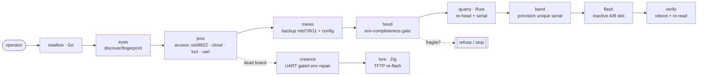

<div align="center">

# 🦅 swallow-ap-hk07-firmware-tools

### Cross-flash and recover EnGenius/Senao `ap-hk07` access points — without bricking them.

A falconry-themed toolkit for the **IPQ807x / `ap-hk07`** board family
(EWS377AP v3 · EWS377-FIT · ECW230v3): one-field firmware re-head, safe serial
provisioning, no-UART flashing, and a gated UART recovery path for when a board
truly won't boot.

[](LICENSE)
[](https://github.com/ParkWardRR/swallow-ap-hk07-firmware-tools/actions/workflows/ci.yml)
[](ROADMAP-DEV.md)
[](SAFETY.md)
[](#contributing)


</div>

---

> ⚠️ **Cross-flashing can brick hardware.** This tool is built to make that nearly
> impossible (see [the two invariants](#the-two-invariants)), but read
> [`SAFETY.md`](SAFETY.md) and the [scope/legal](#scope--legal) notes first.
> **Unofficial — not affiliated with EnGenius or Senao.** For interoperability and
> self-hosting on hardware you own.

## Why

The documented EWS377AP v3 → FIT/cloud "bridge" firmware is EOL and gone. The
sibling `ap-hk07` images *can* be cross-flashed by editing **one field** in the
header — but the manual path is a minefield: a stray `setconfig` wipes the
bootloader env, a hand-rebuilt env bricks the boot slot, SSH hides on port 8822,
and adoption fails silently on a blank serial. This toolkit turns the hard-won,
safe path into the *only* path.

## The two invariants

Everything here exists to preserve two things, so UART is rarely needed:

1. **Write the INACTIVE A/B slot.** The working slot stays bootable → a bad image
   is undone with a factory-reset hold. No UART.
2. **The bootloader env is APPEND-ONLY.** Only `fw_setenv <field>` on a
   *verified-complete* env — the tool **cannot** erase it or save a partial one.
   A valid-but-incomplete env is the one thing that bricks; the code is
   structurally incapable of producing one.

## Architecture (falconry pipeline)



| Codename | Role (falconry) | Lang |
|---|---|---|
| **swallow** | the tool | Go |
| **quarry** | firmware header re-head + serial math (the prey you re-head) | Rust |
| **eyas** | discovery + fingerprint (the nestling that spots quarry) | Go |
| **jess** | device-access tether (ssh/cloud/luci/uart) | Go |
| **mews** | backup/evidence bundle (the shelter) | Go |
| **hood** | safety gate that keeps the raptor calm (env-complete, append-only) | Go |
| **band** | identity provisioning (ringing a bird) | Go |
| **creance** | UART console (the long training line) | Go |
| **lure** | deep-brick TFTP recovery (calls it back) | Zig |

## Status — phase 1 shipped

The **`quarry`** core is done, tested, and usable today; `swallow` (Go) and `lure`
(Zig) are building skeletons that grow phase by phase.
See [ROADMAP-DEV.md](ROADMAP-DEV.md) · [ROADMAP-PRODUCT.md](ROADMAP-PRODUCT.md).

## Quick start (`quarry`, works now)

```console
$ cargo build --release            # from repo root
$ Q=target/release/quarry

$ $Q inspect firmware.bin          # read the Senao header
$ $Q rehead ecw230v3.bin out.bin --to 282   # ECW230v3 image -> pass the v3 gate
$ $Q serial  --model X42 --prefix EPC1 --suffix 0001   # -> EPC1X4200011
$ $Q snextra --model X42 --prefix EPC1                 # -> 20-char field-19 value
$ $Q check   EPC1X4200011          # validate a serial's Code27 check char
```

Product ids: `282` EWS377AP v3 · `300` EWS377-FIT · `284` ECW230v3.
Model codes: `X44` EWS377AP v3 · `X45` EWS377-FIT · `X42` ECW230v3.

## Build

```console
cargo test --workspace     # Rust core (12 tests)
cd go  && go build ./...   # Go orchestrator
cd zig && zig build        # Zig recovery helper (0.16)
```

## Spec-driven

Built with [GitHub Spec Kit](https://github.com/github/spec-kit) discipline —
**Specify → Plan → Tasks → Implement → Validate**:
- [`.specify/memory/constitution.md`](.specify/memory/constitution.md) — principles
- [`specs/001-swallow-mvp/spec.md`](specs/001-swallow-mvp/spec.md) · [`plan.md`](specs/001-swallow-mvp/plan.md) · [`tasks.md`](specs/001-swallow-mvp/tasks.md)

## Scope & legal

Unofficial community tooling for **interoperability and self-hosting on hardware
you own**. "EnGenius" and "Senao" are trademarks of their owners, used only to
name the affected products; no endorsement or affiliation is implied. **No vendor
firmware is redistributed here** — you supply your own images. Do not use this for
warranty fraud, evading paid licensing on hardware you don't own, or defeating
theft protection. Cross-flashing/synthetic serials are unsupported and may void
warranty/support. No warranty; use at your own risk. See [`SAFETY.md`](SAFETY.md).

## Contributing

Issues and PRs welcome — especially recorded device fixtures and verified model
codes. Everything must satisfy the [constitution](.specify/memory/constitution.md)
(no-brick invariants, no infra/secret leaks).

## Credits

Born from a real cross-flash + recovery saga; the firmware/adoption groundwork is
documented in the [engenius-field-guide](https://github.com/ParkWardRR/engenius-field-guide),
building on [DaveCorder's EnGenius notes](https://github.com/DaveCorder/EnGenius).

## License

[Blue Oak Model License 1.0.0](LICENSE).
