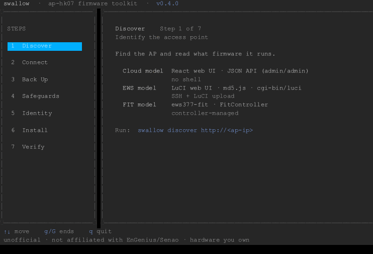
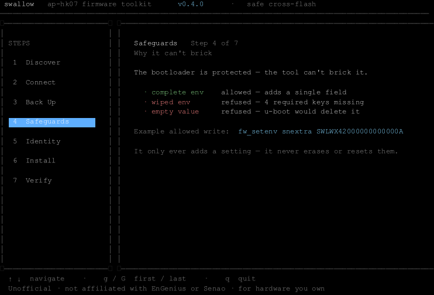
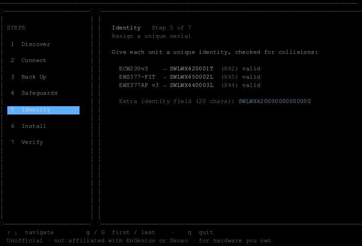
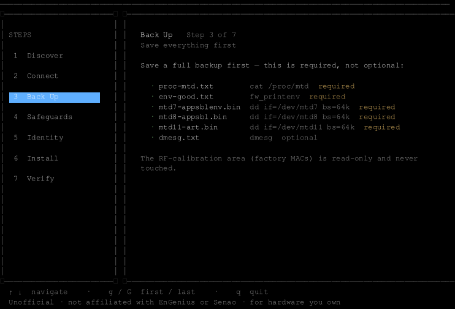
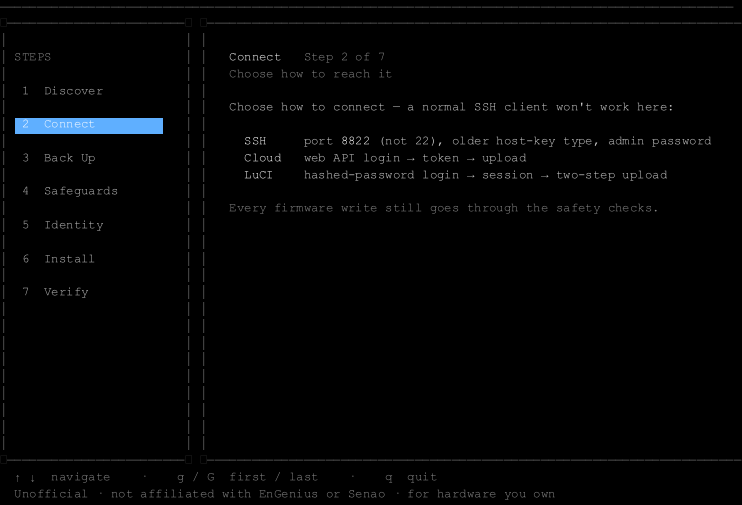
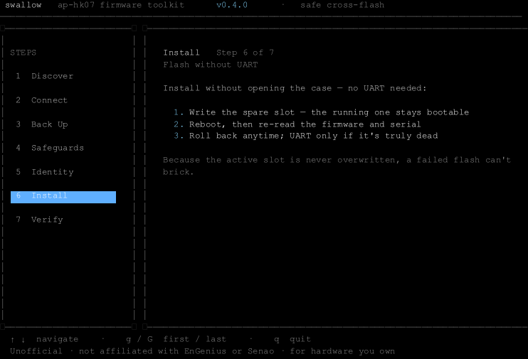
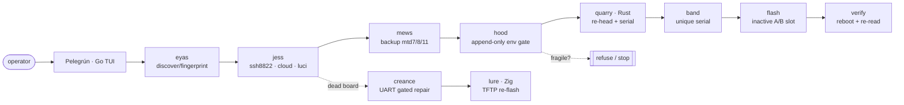

<div align="center">

# Pelegrún · ap-hk07 firmware tools

Cross-flash and recover EnGenius/Senao `ap-hk07` access points (EWS377AP v3 ·
EWS377-FIT · ECW230v3) over the network. One-field firmware re-head, serial
provisioning, A/B-slot flashing, and a gated UART recovery path. Rust core, Go
TUI/CLI, Zig recovery helper. The TUI walks the job in seven steps:
Discover · Connect · Back Up · Safeguards · Identity · Install · Verify.

[](LICENSE)
[-informational.svg)](Makefile)
[](https://github.com/ParkWardRR/pelegrun-ap-hk07-firmware-tools/releases)
[](ROADMAP.md)
[](SAFETY.md)


<br/>



</div>

---

> **Work in progress — mostly untested.** The unit and property test suites
> pass, but end-to-end device testing is still ongoing. Treat this as
> experimental software. It will be validated further over time; feedback and
> bug reports are welcome.

> **Cross-flashing can brick hardware.** Pelegrún is designed so the common
> mistakes aren't reachable (see [the two invariants](#the-two-invariants)), but
> firmware work is never zero-risk. Read [`SAFETY.md`](SAFETY.md) and the
> [scope/legal](#scope--legal) notes first. Unofficial — not affiliated with
> EnGenius or Senao. For hardware you own.

## Why

The documented EWS377AP v3 → FIT/cloud bridge firmware is EOL and gone. The
sibling `ap-hk07` images can be cross-flashed by editing one header field, but the
manual path is easy to get wrong: a stray `setconfig` wipes the bootloader env, a
hand-rebuilt env bricks the boot slot, SSH is on **port 8822**, and adoption fails
silently on a blank serial. Pelegrún encodes the safe path so those mistakes aren't
reachable.

## The two invariants

Two rules keep a failed flash recoverable over the network, so UART is rarely
needed:

1. **Writes go to the `INACTIVE` A/B slot.** The working slot stays bootable — a
   bad image is undone with a factory-reset hold.
2. **The bootloader env is `APPEND-ONLY`.** The tool only adds single fields to an
   env it has *verified complete*; it **cannot** erase it or save a partial one.
   A valid-but-incomplete env is the one thing that bricks — the code is
   structurally incapable of producing one.

**When UART *is* required.** Wire up a USB-TTL serial adapter to the console
header only when the network path is already gone:

- **No shell and no web UI** — the device won't boot far enough to reach SSH:8822,
  the cloud API, or LuCI, so there's nothing for `jess` to talk to.
- **A wiped or incomplete bootloader env** already bricked the board (e.g. a prior
  hand-edit) — `creance` drives the gated `env default -a → inspect → env save`
  repair over the console.
- **The rootfs itself is gone** and only u-boot answers — `lure` serves a fresh
  image to `tftpboot` over the wire.
- **First flash of a new/unproven model**, as a safety net (recommended, not
  required).

If the AP still shells or serves its web UI, everything above happens over the
network and no UART is needed.

<div align="center">

<br/><sub>The <b>Safeguards</b> screen refuses to write a wiped env, and refuses an empty value (which u-boot would delete). Live output — this is exactly what the tool computes.</sub>
</div>

## The TUI

`pelegrun` with no arguments opens the dashboard. The sidebar is the seven-step
sequence — Discover · Connect · Back Up · Safeguards · Identity · Install ·
Verify — and each screen renders live output from the real internal packages, not
mock data.

| | |
|:--:|:--:|
|  |  |
| <sub><b>Identity</b> — unique, collision-checked serials</sub> | <sub><b>Back Up</b> — read-only evidence bundle, first</sub> |
|  |  |
| <sub><b>Connect</b> — SSH :8822 · cloud · LuCI</sub> | <sub><b>Install</b> — no-UART A/B slot flash + verify</sub> |

> These screenshots are generated by the **[termwright](https://github.com/fcoury/termwright)**
> E2E harness that drives the TUI in a PTY and asserts each screen — so the README
> can never drift from the real UI. Run `make screenshots` (see [`tools/tui-harness`](tools/tui-harness)).

## Architecture (falconry pipeline)



The codenames below are the internal package names — the **UI never shows them**.
The middle column maps each to its plain-language screen.

| Codename | UI screen · role | Lang | State |
|---|---|---|---|
| **Pelegrún** | the tool + TUI | Go | ✅ |
| **quarry** | *(core)* header re-head + Code27 serial (the prey) | Rust | ✅ tested |
| **eyas** | **Discover** — fingerprint the AP (the nestling) | Go | ✅ tested |
| **jess** | **Connect** — access tether (ssh/cloud/luci) | Go | ✅ tested |
| **mews** | **Back Up** — backup/evidence bundle (the shelter) | Go | ✅ tested |
| **hood** | **Safeguards** — append-only env safety gate | Go | ✅ tested |
| **band** | **Identity** — unique serial provisioning (ringing a bird) | Go | ✅ tested |
| **flash** | **Install** / **Verify** — no-UART A/B flash + rollback | Go | ✅ tested |
| **creance** | UART gated env repair (the training line) | Go | ✅ tested |
| **lure** | deep-brick TFTP recovery responder | Zig | ✅ integration-tested |

Beyond the single-device pipeline, the fleet/product layer adds `fleet` (P9
inventory · policy · plan/apply · canary · durable journal · resumable executor),
`fleetexec` (SSH + cloud accessors wiring the executor to real I/O), `fitadopt`
(P10 FIT real-serial eligibility + post-adoption proof), `dump` (on-device
verified full-flash capture), `redact` (secret scrubbing for support bundles), and
`adapter` (P12 capability contract + support registry). See
[`ROADMAP.md`](ROADMAP.md) and [`docs/HANDOFF.md`](docs/HANDOFF.md).

## Install

Download a prebuilt binary from the
[latest release](https://github.com/ParkWardRR/pelegrun-ap-hk07-firmware-tools/releases/latest)
and **verify the checksum** — binaries ship for `darwin/{arm64,amd64}`,
`linux/{amd64,arm64}`, and `windows/amd64`:

```console
$ curl -LO .../releases/latest/download/pelegrun-linux-amd64
$ curl -LO .../releases/latest/download/SHA256SUMS
$ sha256sum -c SHA256SUMS --ignore-missing && chmod +x pelegrun-linux-amd64
```

Prefer source? `cd go && go build ./cmd/pelegrun`. Full walkthrough:
**[docs/USAGE.md](docs/USAGE.md)**.

## Quick start

```console
# the TUI
$ cd go && go run ./cmd/pelegrun

# scriptable subcommands
$ pelegrun discover http://192.168.1.1     # fingerprint firmware family
$ pelegrun serial  --model X42             # unique Code27 serial (band)
$ pelegrun snextra --model X42             # 20-char u-boot field-19 value
$ pelegrun envcheck env.txt                # hood completeness gate (refuses fragile)

# firmware re-head (Rust core)
$ cd .. && cargo run -q -p quarry -- rehead ecw230v3.bin out.bin --to 282
$ cargo run -q -p quarry -- serial --model X42 --prefix EPC1 --suffix 0001   # EPC1X4200011
```

### Fleet, safety & recovery commands

All of these are **read-only / plan-only** — they change nothing on a device.
Runnable fixtures live in [`examples/`](examples/).

```console
# P9 fleet rollout — build a deterministic plan, then revalidate it before apply
$ pelegrun fleet plan  --inventory examples/fleet-inventory.json \
      --policy examples/fleet-policy.json \
      --image fw.bin --image-sha256 <hex> --family cloud --out plan.json
$ pelegrun fleet apply --inventory examples/fleet-inventory.json \
      --policy examples/fleet-policy.json --plan plan.json \
      --image fw.bin --image-sha256 <hex> --family cloud --max-age 1h

# on-device verified full-flash capture (safety net before any flash)
$ pelegrun dump plan --dest /tmp/pelegrun-dump < /proc/mtd

# P10 FIT real-serial adoption gates (never generates/spoofs a serial)
$ pelegrun fit check --request examples/fit-request.json
$ pelegrun fit prove --expected examples/fit-expected.json --observed examples/fit-observed.json

# scrub secrets before sharing a support bundle; inspect the board support registry
$ pelegrun redact bundle.txt --mac --value <serial>
$ pelegrun adapters list          # tier + capabilities + flashability (ap-hk07 = experimental)
```

Product ids: `282` EWS377AP v3 · `300` EWS377-FIT · `284` ECW230v3 · `275` ECW230 · `182` EWS377AP v2 · `285` ECW230S.
Model codes: `X44` EWS377AP v3 · `X45` EWS377-FIT · `X42` ECW230v3.

> The header parser is verified against **real vendor images** across the family
> — see `make test-firmware FW=<dir>`. All ids/models above were read from
> genuine firmware; nothing is committed to the repo. (`285` ECW230S is labelled
> but is a related cloud AP, **not** a verified cross-flash target.)

## Run OpenWrt on the EWS377AP v3

Beyond cross-flashing OEM images, there's now a **community [OpenWrt](https://openwrt.org/)
build** for the EWS377AP v3 (`ap-hk07`, IPQ8072A) — kernel 6.18 with Qualcomm NSS
offload — **validated on hardware**: persistent NAND boot, Ethernet, WiFi (WPA2), and
config surviving reboots.

- **Images + `SHA256SUMS`:** [Releases](https://github.com/ParkWardRR/pelegrun-ap-hk07-firmware-tools/releases) → tag `openwrt-ews377ap-v3-v0.1`
- **Install & back-to-stock guide:** **[`docs/openwrt-ews377ap-v3.md`](docs/openwrt-ews377ap-v3.md)**
- **Source:** fork branch `ews377ap-v3` of [`openwrt-nss-edma`](https://github.com/ParkWardRR/openwrt-nss-edma)

OpenWrt is GPL and freely redistributable (unlike OEM images, which you still supply
yourself). It **overwrites the OEM slot — back up your NAND first**. Only the
UART/u-boot install is hardware-proven; the web-upload `.bin` is experimental. Full
steps (including restore to stock) are in the guide.

## Build & test

CI is **local only** — this project runs no hosted CI (no GitHub Actions). One
`make` front-end drives all three languages (`make help` lists everything):

```console
make ci            # the project's CI: fmt-check + lint + tests (race), 3 langs
make hooks         # enable the pre-push gate that runs `make ci` before each push
make test          # every suite: cargo test · go test · zig build test · lure integration
make cover         # Go coverage summary (currently ~89% of statements)
make fmt           # auto-format Rust + Go + Zig
make dist          # cross-compiled binaries + SHA256SUMS → dist/
```

Run `make hooks` once per clone so `git push` is gated on a green `make ci`
(bypass in an emergency with `git push --no-verify`).

What's covered:

- **Rust (`quarry`)** — unit + **property tests** (`tests/properties.rs`, 5 invariants × 5000 generated cases) + error/display tests + an opt-in **real-image test** (`make test-firmware`) validating the parser against genuine firmware (6 product ids across ~26 images); `cargo fmt --check` and `clippy -D warnings` gate `make ci`.
- **Go (`pelegrun`)** — every package tested (CLI, TUI model, `eyas` with recorded HTTP fixtures, `jess` adapters via `httptest`, `hood`/`band`/`flash`/`mews`/`creance`), plus a **Go↔Rust parity test** (`band` vs. the `quarry` binary); run under the **race detector**; `gofmt` + `go vet` gated.
- **Zig (`lure`)** — unit tests (`zig build test`) for the TFTP parsing helpers + a real **multi-block transfer integration test**; `zig fmt --check` gated.

## Spec-driven

Built with [GitHub Spec Kit](https://github.com/github/spec-kit) discipline —
**Specify → Plan → Tasks → Implement → Validate**:
[constitution](.specify/memory/constitution.md) ·
[spec](specs/001-pelegrun-mvp/spec.md) · [plan](specs/001-pelegrun-mvp/plan.md) ·
[tasks](specs/001-pelegrun-mvp/tasks.md) · [roadmap](ROADMAP.md).

## Scope & legal

Unofficial community tooling for **interoperability and self-hosting on hardware
you own**. "EnGenius" and "Senao" are trademarks of their owners, used only to
name the affected products; no endorsement or affiliation is implied. **No vendor
firmware is redistributed here** — you supply your own images. Do not use this for
warranty fraud, evading paid licensing on hardware you don't own, or defeating
theft protection. Cross-flashing/synthetic serials are unsupported and may void
warranty/support. No warranty; use at your own risk. See [`SAFETY.md`](SAFETY.md).

## Credits

Born from a real cross-flash + recovery saga documented in the
[engenius-field-guide](https://github.com/ParkWardRR/engenius-field-guide),
building on [DaveCorder's EnGenius notes](https://github.com/DaveCorder/EnGenius).
TUI by [Bubble Tea](https://github.com/charmbracelet/bubbletea); screenshots by
[termwright](https://github.com/fcoury/termwright).

## License

[Blue Oak Model License 1.0.0](LICENSE).
