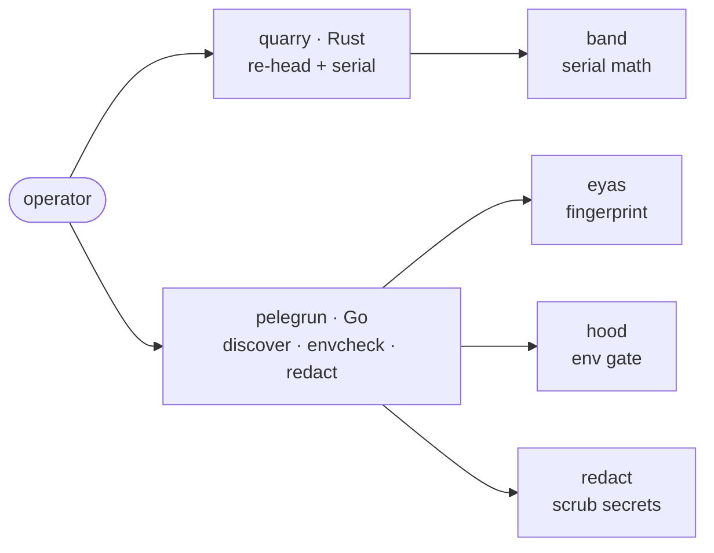

<div align="center">

# Pelegrún · ap-hk07 firmware tools

Cross-flash and recover EnGenius/Senao `ap-hk07` access points (EWS377AP v3 ·
EWS377-FIT · ECW230v3) over the network. One-field firmware re-head, serial
provisioning, and a gated recovery path. Rust core (`quarry`) plus three
focused Go CLI utilities (`discover`, `envcheck`, `redact`).

[](LICENSE)
[-informational.svg)](Makefile)
[](https://github.com/ParkWardRR/pelegrun-ap-hk07-firmware-tools/releases)
[](SAFETY.md)


</div>

---

> **Work in progress — mostly untested.** The unit and property test suites
> pass, but end-to-end device testing is still ongoing. Treat this as
> experimental software. It will be validated further over time; feedback and
> bug reports are welcome.

> **Cross-flashing can brick hardware.** Pelegrún is designed so the common
> mistakes aren't reachable (see [the two invariants](#the-two-invariants)), but
> firmware work is never zero-risk. Read [`SAFETY.md`](SAFETY.md) and the
> [scope/legal](#scope--legal) notes first. Unofficial — not affiliated with
> EnGenius or Senao. For hardware you own.

## Why

The documented EWS377AP v3 → FIT/cloud bridge firmware is EOL and gone. The
sibling `ap-hk07` images can be cross-flashed by editing one header field, but the
manual path is easy to get wrong: a stray `setconfig` wipes the bootloader env, a
hand-rebuilt env bricks the boot slot, SSH is on **port 8822**, and adoption fails
silently on a blank serial. Pelegrún encodes the safe path so those mistakes aren't
reachable.

## The two invariants

Two rules keep a failed flash recoverable over the network, so UART is rarely
needed:

1. **Writes go to the `INACTIVE` A/B slot.** The working slot stays bootable — a
   bad image is undone with a factory-reset hold.
2. **The bootloader env is `APPEND-ONLY`.** The tool only adds single fields to an
   env it has *verified complete*; it **cannot** erase it or save a partial one.
   A valid-but-incomplete env is the one thing that bricks — the code is
   structurally incapable of producing one.

**When UART *is* required.** Wire up a USB-TTL serial adapter to the console
header only when the network path is already gone:

- **No shell and no web UI** — the device won't boot far enough to reach SSH:8822,
  the cloud API, or LuCI.
- **A wiped or incomplete bootloader env** already bricked the board (e.g. a prior
  hand-edit).
- **The rootfs itself is gone** and only u-boot answers — serve a fresh image via
  TFTP.
- **First flash of a new/unproven model**, as a safety net (recommended, not
  required).

If the AP still shells or serves its web UI, everything above happens over the
network and no UART is needed.

## Architecture


```mermaid
flowchart LR
  U([operator]) --> Q[quarry · Rust<br/>re-head + serial]
  U --> P[pelegrun · Go<br/>discover · envcheck · redact]
  P --> E[eyas<br/>fingerprint]
  P --> H[hood<br/>env gate]
  P --> R[redact<br/>scrub secrets]
  Q --> B[band<br/>serial math]
```

| Component | Role | Lang |
|---|---|---|
| **quarry** | Image header re-head, Code27 serial, snextra, inspect | Rust |
| **pelegrun discover** | Fingerprint the AP's firmware family (Cloud · EWS/LuCI · FIT) | Go |
| **pelegrun envcheck** | Verify bootloader env completeness — refuses a fragile env | Go |
| **pelegrun redact** | Scrub passwords, tokens, keys, MACs, and specific values from logs | Go |

Internal packages: `eyas` (fingerprint), `hood` (env parsing), `jess` (HTTP client),
`band` (serial math), `redact` (secret scrubbing).

## Install

Download a prebuilt binary from the
[latest release](https://github.com/ParkWardRR/pelegrun-ap-hk07-firmware-tools/releases/latest)
and **verify the checksum** — binaries ship for `darwin/{arm64,amd64}`,
`linux/{amd64,arm64}`, and `windows/amd64`:

```console
$ curl -LO .../releases/latest/download/pelegrun-linux-amd64
$ curl -LO .../releases/latest/download/SHA256SUMS
$ sha256sum -c SHA256SUMS --ignore-missing && chmod +x pelegrun-linux-amd64
```

Prefer source? `cd go && go build ./cmd/pelegrun`. Full walkthrough:
**[docs/USAGE.md](docs/USAGE.md)**.

## Quick start

```console
# pelegrun CLI utilities
$ pelegrun discover http://192.168.1.1     # fingerprint firmware family
$ pelegrun serial  --model X42             # unique Code27 serial (band)
$ pelegrun snextra --model X42             # 20-char u-boot field-19 value
$ pelegrun check   EPC1X4200011            # validate a serial
$ pelegrun envcheck env.txt                # hood completeness gate (refuses fragile)
$ pelegrun redact  bundle.txt --mac --value <serial>   # scrub secrets

# firmware re-head (Rust core)
$ cargo run -q -p quarry -- rehead ecw230v3.bin out.bin --to 282
$ cargo run -q -p quarry -- serial --model X42 --prefix EPC1 --suffix 0001
$ cargo run -q -p quarry -- inspect firmware.bin
```

Product ids: `282` EWS377AP v3 · `300` EWS377-FIT · `284` ECW230v3 · `275` ECW230 · `182` EWS377AP v2 · `285` ECW230S.
Model codes: `X44` EWS377AP v3 · `X45` EWS377-FIT · `X42` ECW230v3.

> The header parser is verified against **real vendor images** across the family
> — see `make test-firmware FW=<dir>`. All ids/models above were read from
> genuine firmware; nothing is committed to the repo. (`285` ECW230S is labelled
> but is a related cloud AP, **not** a verified cross-flash target.)

## Run OpenWrt on the EWS377AP v3

Beyond cross-flashing OEM images, there's now a **community [OpenWrt](https://openwrt.org/)
build** for the EWS377AP v3 (`ap-hk07`, IPQ8072A) — kernel 6.18 with Qualcomm NSS
offload — **validated on hardware**: persistent NAND boot, Ethernet, WiFi (WPA2), and
config surviving reboots.

- **Images + `SHA256SUMS`:** [Releases](https://github.com/ParkWardRR/pelegrun-ap-hk07-firmware-tools/releases) → tag `openwrt-ews377ap-v3-v0.1`
- **Install & back-to-stock guide:** **[`docs/openwrt-ews377ap-v3.md`](docs/openwrt-ews377ap-v3.md)**
- **Source:** fork branch `ews377ap-v3` of [`openwrt-nss-edma`](https://github.com/ParkWardRR/openwrt-nss-edma)

OpenWrt is GPL and freely redistributable (unlike OEM images, which you still supply
yourself). It **overwrites the OEM slot — back up your NAND first**. Only the
UART/u-boot install is hardware-proven; the web-upload `.bin` is experimental. Full
steps (including restore to stock) are in the guide.

## Build & test

CI is **local only** — this project runs no hosted CI (no GitHub Actions). One
`make` front-end drives both languages (`make help` lists everything):

```console
make ci            # the project's CI: fmt-check + lint + tests (race)
make hooks         # enable the pre-push gate that runs `make ci` before each push
make test          # every suite: cargo test + go test
make cover         # Go coverage summary
make fmt           # auto-format Rust + Go
make dist          # cross-compiled binaries + SHA256SUMS → dist/
```

Run `make hooks` once per clone so `git push` is gated on a green `make ci`
(bypass in an emergency with `git push --no-verify`).

What's covered:

- **Rust (`quarry`)** — unit + **property tests** (`tests/properties.rs`, 5 invariants × 5000 generated cases) + error/display tests + an opt-in **real-image test** (`make test-firmware`) validating the parser against genuine firmware (6 product ids across ~26 images); `cargo fmt --check` and `clippy -D warnings` gate `make ci`.
- **Go (`pelegrun`)** — every package tested (CLI, `eyas` with recorded HTTP fixtures, `jess` adapters via `httptest`, `hood`/`band`/`redact`), plus a **Go↔Rust parity test** (`band` vs. the `quarry` binary); run under the **race detector**; `gofmt` + `go vet` gated.

## Spec-driven

Built with [GitHub Spec Kit](https://github.com/github/spec-kit) discipline —
**Specify → Plan → Tasks → Implement → Validate**:
[constitution](.specify/memory/constitution.md) ·
[spec](specs/001-pelegrun-mvp/spec.md) · [plan](specs/001-pelegrun-mvp/plan.md) ·
[tasks](specs/001-pelegrun-mvp/tasks.md) · [roadmap](ROADMAP.md).

## Scope & legal

Unofficial community tooling for **interoperability and self-hosting on hardware
you own**. "EnGenius" and "Senao" are trademarks of their owners, used only to
name the affected products; no endorsement or affiliation is implied. **No vendor
firmware is redistributed here** — you supply your own images. Do not use this for
warranty fraud, evading paid licensing on hardware you don't own, or defeating
theft protection. Cross-flashing/synthetic serials are unsupported and may void
warranty/support. No warranty; use at your own risk. See [`SAFETY.md`](SAFETY.md).

## Credits

Born from a real cross-flash + recovery saga documented in the
[engenius-field-guide](https://github.com/ParkWardRR/engenius-field-guide),
building on [DaveCorder's EnGenius notes](https://github.com/DaveCorder/EnGenius).

## License

[Blue Oak Model License 1.0.0](LICENSE).
