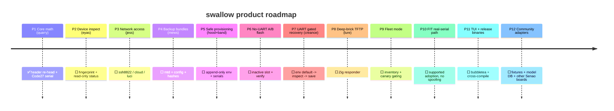

# Product roadmap (12 phases)

Where **swallow** is headed as a product. Falconry codenames in parentheses.
Status: ✅ done · 🟡 in progress · ⬜ planned.

| # | Phase | Codename | What ships | Status |
|---|-------|----------|-----------|--------|
| 1 | Core image + serial math | quarry | one-field re-head, Code27, snextra, CLI | ✅ |
| 2 | Firmware fingerprint + read-only inspect | eyas | detect EWS-LuCI / cloud-React / FIT; dump identity | ⬜ |
| 3 | Network access adapters | jess | SSH:8822, cloud GUI API, LuCI | ⬜ |
| 4 | Backup & evidence bundles | mews | mtd7/8/11 + config + firmware hashes, gated | ⬜ |
| 5 | Safe env provisioning | hood + band | append-only writes, unique serials, collision preflight | ⬜ |
| 6 | No-UART A/B flash + verify | — | write inactive slot, reboot-verify, rollback | ⬜ |
| 7 | UART gated recovery | creance | scripted `env default -a → inspect → env save` | ⬜ |
| 8 | Deep-brick TFTP recovery | lure | Zig TFTP/BOOTP responder embedded in the binary | ⬜ |
| 9 | Fleet mode | — | inventory, unique-serial issuance, batch, canary gates | ⬜ |
| 10 | FIT real-serial path | — | adopt via FIT ≥ v1.1.65 with the device's real serial | ⬜ |
| 11 | TUI + release binaries | — | bubbletea UI, signed cross-compiled binaries, checksums | ⬜ |
| 12 | Community & extensibility | — | recorded fixtures, model-code DB, adapters for other Senao boards | ⬜ |
