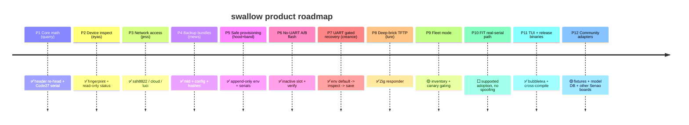

# Roadmap

Two views of the same project. The **development roadmap** is the engineering
execution order (all six phases complete as of **v0.4.0**); the **product
roadmap** is the wider product surface and where swallow is still headed. Detailed
task list: [specs/001-swallow-mvp/tasks.md](specs/001-swallow-mvp/tasks.md).

Status: ✅ done · 🟡 in progress · ⬜ planned.

---

## Development roadmap (6 phases)

Engineering execution order.

| Phase | Scope | Deliverable | Status |
|-------|-------|-------------|--------|
| 1 | Core + scaffold | tested `quarry` (Rust) + `swallow`/Zig skeletons + Spec Kit + CI | ✅ done |
| 2 | Access + discovery | `eyas` fingerprint, `jess` ssh/cloud/luci adapters | ✅ done |
| 3 | Safety + backup + provision | `hood` env gate, `mews` bundles, `band` serials | ✅ done |
| 4 | No-UART A/B flash | slot-aware flash + verify + rollback | ✅ done |
| 5 | UART recovery | `creance` gated serial repair, `lure` Zig TFTP responder | ✅ done |
| 6 | Release polish | cross-compiled binaries + checksums, fixture/property tests, user docs | ✅ done |

**All 6 phases complete.** Rust unit + property tests (5 invariants) + real-image
validation, Go 7 packages incl. recorded fixtures + a Go↔Rust parity test, Zig
`lure` unit + TFTP integration tests, and termwright terminal-E2E all green.
Releases ship cross-compiled binaries (Go ×5, Zig `lure` ×4) with `SHA256SUMS`
via a tag-triggered workflow.

---

## Product roadmap (12 phases)

Where **swallow** is headed as a product. Falconry codenames in parentheses.

| # | Phase | Codename | What ships | Status |
|---|-------|----------|-----------|--------|
| 1 | Core image + serial math | quarry | one-field re-head, Code27, snextra, CLI | ✅ |
| 2 | Firmware fingerprint + read-only inspect | eyas | detect EWS-LuCI / cloud-React / FIT; `quarry inspect` dumps header identity | ✅ |
| 3 | Network access adapters | jess | SSH:8822, cloud GUI API, LuCI | ✅ |
| 4 | Backup & evidence bundles | mews | mtd7/8/11 + config + firmware hashes, gated | ✅ |
| 5 | Safe env provisioning | hood + band | append-only writes, unique serials, collision preflight | ✅ |
| 6 | No-UART A/B flash + verify | flash | write inactive slot, reboot-verify, rollback | ✅ |
| 7 | UART gated recovery | creance | scripted `env default -a → inspect → env save` | ✅ |
| 8 | Deep-brick TFTP recovery | lure | Zig TFTP responder (unit + integration tested) | ✅ |
| 9 | Fleet mode | band | inventory + unique-serial issuance + collision preflight ✅; batch + canary-gate automation ⬜ | 🟡 |
| 10 | FIT real-serial path | — | adopt via FIT ≥ v1.1.65 with the device's real serial | ⬜ |
| 11 | TUI + release binaries | swallow | bubbletea UI ✅, cross-compiled binaries + SHA256SUMS via tag workflow ✅ | ✅ |
| 12 | Community & extensibility | — | recorded fixtures ✅, product-id/model DB ✅ (6 ids verified from real images); adapters for other Senao boards ⬜ | 🟡 |

**Shipped:** phases 1–8 and 11 (all six dev phases above). **Remaining product
surface:** fleet batch/canary automation (P9), the supported FIT real-serial
adoption path (P10), and adapters for Senao boards beyond `ap-hk07` (P12).
