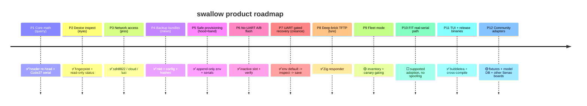

# Roadmap

Two views of the same project. The **development roadmap** is the engineering
execution order (all six phases complete as of **v0.4.0**); the **product
roadmap** is the wider product surface and where swallow is still headed. Detailed
task list: [specs/001-swallow-mvp/tasks.md](specs/001-swallow-mvp/tasks.md).

The remaining work is not another single-device flasher feature; it is the
transition from a safe, validated **operator tool** into a scalable, supportable
**product**. Fleet execution, FIT adoption, and community adapters must be
**policy- and evidence-driven**. The existing single-device safety gates (`hood`,
`mews`, inactive-slot flash/rollback, UART recovery) are necessary foundations,
but fleet mode needs explicit identity, state persistence, concurrency controls,
staged-rollout rules, telemetry, and stop conditions; community adapters need a
published capability contract, fixture corpus, and hardware-qualification matrix
rather than ad hoc board additions.

> **Scope guarantee:** preserve the current safety posture. A user must never be
> able to turn a fleet workflow into an unbounded destructive loop merely by
> adding `--yes`.

Status: ✅ done · 🟡 in progress · ⬜ planned.

---

## Development roadmap (6 phases)

Engineering execution order.


| Phase | Scope | Deliverable | Status |
|-------|-------|-------------|--------|
| 1 | Core + scaffold | tested `quarry` (Rust) + `swallow`/Zig skeletons + Spec Kit + CI | ✅ done |
| 2 | Access + discovery | `eyas` fingerprint, `jess` ssh/cloud/luci adapters | ✅ done |
| 3 | Safety + backup + provision | `hood` env gate, `mews` bundles, `band` serials | ✅ done |
| 4 | No-UART A/B flash | slot-aware flash + verify + rollback | ✅ done |
| 5 | UART recovery | `creance` gated serial repair, `lure` Zig TFTP responder | ✅ done |
| 6 | Release polish | cross-compiled binaries + checksums, fixture/property tests, user docs | ✅ done |

**All 6 phases complete.** Rust unit + property tests (5 invariants) + real-image
validation, Go 7 packages incl. recorded fixtures + a Go↔Rust parity test, Zig
`lure` unit + TFTP integration tests, and termwright terminal-E2E all green.
Releases ship cross-compiled binaries (Go ×5, Zig `lure` ×4) with `SHA256SUMS`
built locally via `make dist` (`scripts/dist.sh`). This project uses no hosted
CI: `make ci` is the gate, enforced locally by the `githooks/pre-push` hook.

---

## Product roadmap (12 phases)

Where **swallow** is headed as a product. Falconry codenames in parentheses.



| # | Phase | Codename | What ships | Status |
|---|-------|----------|-----------|--------|
| 1 | Core image + serial math | quarry | one-field re-head, Code27, snextra, CLI | ✅ |
| 2 | Firmware fingerprint + read-only inspect | eyas | detect EWS-LuCI / cloud-React / FIT; `quarry inspect` dumps header identity | ✅ |
| 3 | Network access adapters | jess | SSH:8822, cloud GUI API, LuCI | ✅ |
| 4 | Backup & evidence bundles | mews | mtd7/8/11 + config + firmware hashes, gated | ✅ |
| 5 | Safe env provisioning | hood + band | append-only writes, unique serials, collision preflight | ✅ |
| 6 | No-UART A/B flash + verify | flash | write inactive slot, reboot-verify, rollback | ✅ |
| 7 | UART gated recovery | creance | scripted `env default -a → inspect → env save` | ✅ |
| 8 | Deep-brick TFTP recovery | lure | Zig TFTP responder (unit + integration tested) | ✅ |
| 9 | Fleet mode | band | inventory + unique-serial issuance + collision preflight ✅; batch + canary-gate automation ⬜ | 🟡 |
| 10 | FIT real-serial path | — | adopt via FIT ≥ v1.1.65 with the device's real serial | ⬜ |
| 11 | TUI + release binaries | swallow | bubbletea UI ✅, cross-compiled binaries + SHA256SUMS via local `make dist` ✅ | ✅ |
| 12 | Community & extensibility | — | recorded fixtures ✅, product-id/model DB ✅ (6 ids verified from real images); adapters for other Senao boards ⬜ | 🟡 |

**Shipped:** phases 1–8 and 11 (all six dev phases above). **Remaining product
surface:** fleet batch/canary automation (P9), the supported FIT real-serial
adoption path (P10), and adapters for Senao boards beyond `ap-hk07` (P12). The
sections below reshape those three remaining phases into delivery gates and
define the architecture, safety model, and evidence each one must satisfy.

---

## Product hardening gates

The remaining work changes swallow from a safe single-device tool into a fleet
and multi-board product. Every new product phase must preserve the same safety
guarantees: explicit identity, immutable operation plans, durable journals,
evidence-backed compatibility claims, and tested recovery routes.

```text
P9a fleet evidence model → P9b policy engine + plan/apply → P9c canary orchestration → P9d resumable batch execution → P9e operations integration
                                      ↘
                            P10 supported FIT real-serial adoption
                                      ↘
                        P12 adapter SDK + hardware qualification program
```

### Priority additions

| Priority | Add to roadmap | Why it matters | Placement |
|---|---|---|---|
| P0 | **P9a: authoritative fleet inventory and identity model** | Batch safety depends on distinguishing physical units, current firmware/slot, reachability, serial state, and prior operation history. IP address and displayed serial alone are not stable fleet identity. | Before batch execution |
| P0 | **P9b: fleet policy engine and plan/apply workflow** | Serial collision preflight is only one policy. A fleet requires explicit eligibility, compatibility, backup, maintenance-window, concurrency, and stop-the-world rules. | Before canary automation |
| P0 | **P9c: canary orchestration plus health gates** | "Canary" must be executable policy: cohort selection, observation duration, pass/fail checks, error budget, and promotion criteria. | P9 core delivery |
| P0 | **P9d: durable, resumable operation journal** | A laptop/CI runner can fail mid-run. Without per-device transactional state, retries can target the wrong phase or obscure the true recovery action. | P9 core delivery |
| P0 | **P10a: FIT eligibility and provenance validator** | FIT support must establish that the image, device family, serial, bootloader state, and target version form an allowed adoption operation before any write/reboot. | Before FIT write path |
| P0 | **P10b: proof-based post-adoption validation and recovery** | A successful command is not successful adoption. Validate boot slot, FIT version, real serial, network access, expected services, and rollback/recovery behavior. | P10 acceptance criteria |
| P1 | **Adapter capability contract / SDK** | P12 will otherwise turn into copy-pasted board-specific procedures with inconsistent safety and test quality. | Before second external-board adapter |
| P1 | **Hardware qualification matrix** | "Adapter exists" differs from "safe to recommend." Capture board revision, flash layout, bootloader, recovery paths, and tested operations. | P12 foundation |
| P1 | **Fixture provenance and redaction policy** | Recorded fixtures are valuable but can leak customer configuration, credentials, serials, MACs, cloud tokens, or signing metadata. | Parallel with P9/P12 |
| P1 | **Threat model and authorization boundary** | The project can mutate firmware, env state, serials, and network-connected devices. Define operator authorization, secret handling, logging/redaction, and supply-chain trust. | Parallel with P9/P10 |
| P1 | **Observability and support bundles** | A fleet failure needs structured per-device evidence, not only terminal output. | P9 core delivery |
| P1 | **Release provenance, SBOM, signatures, rollback compatibility** | SHA256 checksums establish integrity after download but do not alone establish trusted origin or operational compatibility. | Release engineering track |
| P1 | **Explicit support tiers** | Users need a clear distinction among verified, experimental, recovery-only, and unsupported device paths. | P10/P12 documentation |

### P9 — Fleet mode: split into delivery gates

Do not define fleet mode as "loop the existing single-device command over
inventory." Treat it as a control plane that composes safe single-device
primitives under explicit policy.

```text
P9a identity + inventory
  → P9b eligibility/policy + plan/apply
    → P9c canary cohorts + health gates
      → P9d resumable batch executor + reporting
        → P9e operator/CI integration
```

| Subphase | Objective | Definition of done |
|---|---|---|
| **P9a: inventory and identity** | Establish trustworthy fleet state before mutation | Normalized inventory schema, immutable per-device identity, discovery reconciliation, signed/hashed snapshots, stale-data handling |
| **P9b: policy and plan/apply** | Decide exactly which devices may change and why | Deterministic eligibility report; zero destructive action during planning; policy exceptions are explicit and logged |
| **P9c: canary orchestration** | Make staged rollout a real safety control | Cohort selection, concurrent-operation limit, observation window, health gates, promotion/abort rules |
| **P9d: resumable execution** | Survive process/device/network failure safely | Durable per-device state machine, idempotency key, resume/reconcile behavior, clear manual-recovery state |
| **P9e: operations integration** | Make deployment supportable | Structured report formats, metrics/log export, CI/noninteractive mode with equivalent safeguards, runbook |

### P10 — FIT real-serial adoption: split into proof gates

The stated "real serial only; no spoofing" position is non-negotiable. Make the
supported path prove eligibility and result rather than merely perform a write.

```text
P10a eligibility/provenance → P10b dry-run and device attestation → P10c supported adoption → P10d post-adoption proof + rollback/recovery
```

| Subphase | Objective | Definition of done |
|---|---|---|
| **P10a: eligibility/provenance** | Determine whether a target/device/image combination is allowed | FIT version and format validation; image hash/provenance; device-model/layout compatibility; real-serial source and constraints documented |
| **P10b: plan and attestation** | Present exact intended operation before mutation | Immutable plan includes device identity, current state, target image hash/version, actual serial, expected slot, recovery route, policy decision |
| **P10c: supported adoption** | Execute only on proven-compatible devices | Uses only documented supported mechanism; no serial generation/spoofing; all state changes journaled |
| **P10d: outcome proof** | Verify useful, stable success | Reprobe expected identity/FIT version/serial/slot; test access adapter and core service; record rollback result where supported |

### P12 — Community and extensibility: qualify adapters systematically

The first external adapter after `ap-hk07` should establish a reusable adapter
contract, not only add another model.

```text
P12a adapter SDK → P12b fixture/capability test suite → P12c hardware qualification → P12d supported model registry
```

| Subphase | Objective | Definition of done |
|---|---|---|
| **P12a: adapter contract** | Define a minimum interface each board must implement | Typed capabilities, discovery/identity, read-only inspect, backup support, write/reboot behavior, recovery routes, error classification |
| **P12b: tests and fixtures** | Prevent adapter regressions without hardware | Sanitized recorded fixtures, contract tests, negative fixtures, versioned fixture metadata |
| **P12c: qualification** | Establish safety claims from physical evidence | Board-specific tests for normal operation, A/B behavior where present, recovery, power/reboot interruption, and no-op/dry-run |
| **P12d: registry and support tiers** | Publish actionable support state | Machine-readable model DB with board revision, capabilities, tested firmware paths, risks, support tier, evidence links |

---

## P9 fleet architecture

### Authoritative identity model

A fleet record separates **physical identity**, **software identity**, **network
location**, and **operation state**. Do not make mutable identifiers such as DHCP
address, hostname, UI label, or a user-provided serial the sole key.

```yaml
schema_version: 1
device:
  fleet_id: "stable-operator-assigned-uuid"
  physical_identity:
    model: "ap-hk07"
    board_revision: "unknown"
    mac_addresses: []
    hardware_serial: "..."
    identity_confidence: "verified"
  software_identity:
    firmware_family: "..."
    firmware_version: "..."
    firmware_sha256: "..."
    active_slot: "A"
    inactive_slot: "B"
    bootloader_version: "..."
    fit_version: "..."
  access:
    management_address: "..."
    adapter: "ssh8822"
    last_seen_at: "..."
    discovery_snapshot_sha256: "..."
  eligibility:
    state: "eligible"
    policy_version: "..."
    reasons: []
  latest_operation:
    operation_id: "..."
    state: "completed"
    journal_sha256: "..."
```

### Plan/apply workflow

Use a two-stage, immutable operation plan. The planning stage performs all
discovery, compatibility checks, image validation, serial collision analysis,
backup eligibility analysis, and canary cohort selection. It must make no device
changes.

```text
swallow fleet plan --inventory inventory.yaml --target firmware.fit --policy rollout.yaml
swallow fleet apply --plan plan-2026-09-04T1516Z.json
```

The apply command must reject a modified plan, mismatched target hash, changed
policy version, stale discovery beyond the configured age, or a device identity
mismatch. It should permit only explicit, logged overrides.

### Fleet policy model

| Policy area | Required behavior |
|---|---|
| Target eligibility | Model/board/layout/firmware/slot/access requirements must match a declared supported rule |
| Identity certainty | Refuse mutation when device identity is ambiguous, duplicated, stale, or changed since plan |
| Backup requirement | Require a successful `mews` evidence bundle or an explicit documented exception before mutation |
| Serial policy | Unique serial issuance/collision preflight; detect serial changes as a postcondition where relevant |
| Concurrency | Global and per-site/per-network concurrency limit; avoid reboot storms and management-plane saturation |
| Maintenance window | Optional but explicit start/deadline; automatically stop starting new work after deadline |
| Canary cohort | Deterministic selection; represent relevant topology/model/firmware diversity rather than random-only sampling |
| Health gate | Define expected post-change checks, observation duration, minimum pass rate, and threshold for pause/abort |
| Error budget | Stop new rollout work after defined failed, unknown, or manual-intervention-required outcomes |
| Exception process | Overrides require exact fleet/device IDs, reason, operator identity, and durable audit entry |
| Resume semantics | Reconcile observed device state before retry; never blindly repeat a destructive command |

### Canary criteria

A canary should be a cohort with explicit evidence requirements, not simply the
first N devices.

| Gate | Example requirement |
|---|---|
| Preflight | 100% of cohort has matching identity, current inventory state, valid target, and required backup/evidence |
| Execution | Bounded concurrency and per-device timeout; no next phase until each device enters terminal state |
| Immediate validation | Expected slot/version/serial/access adapter passes after reboot |
| Observation | Device remains reachable and passes chosen service/health checks for a configured duration |
| Promotion | Pass rate meets policy and no stop condition triggered |
| Abort | Any critical integrity/recovery event, identity mismatch, or threshold of failed/unknown devices pauses new work |
| Evidence | Per-device journal and summary report attached to the rollout result |

### Durable operation journal

Each device operation needs a state machine distinct from terminal output.
Persist before irreversible actions and on every material state transition.

| State | Safe next action |
|---|---|
| Planned | Revalidate or cancel |
| Preflight passed | Begin only if plan/device/policy are unchanged |
| Backup running | Complete, retry non-destructive backup, or explicitly record policy exception |
| Backup captured | Begin mutation |
| Inactive-slot write in progress | Wait/reconcile; do not start unrelated operation |
| Write verified | Reboot and probe |
| Reboot pending | Reprobe with bounded backoff |
| Post-change validation running | Continue validation or classify timeout/unknown |
| Canary observation | Hold promotion until observation outcome |
| Completed | Archive evidence; no automatic repeat |
| Paused/manual recovery | Stop automation; provide exact device-specific recovery instructions |
| Failed | Preserve evidence; classify retryability; require explicit new plan if destructive retry is proposed |

The journal should include operation ID, tool version, policy hash, plan hash,
target image hash, device fingerprint, time, actor, adapter, stdout/stderr
references, structured errors, and recovery route.

---

## P10 FIT safety model

### FIT adoption preconditions

Before the first destructive or persistent action, require all of the following:

| Gate | Requirement |
|---|---|
| Supported version | FIT version is at least the documented supported floor, currently stated as v1.1.65 or later |
| Image identity | Target image has an immutable SHA-256 and recorded provenance/source |
| Device compatibility | Exact model/board/flash-layout/bootloader constraints pass; no inference from marketing name alone |
| Real serial | Serial is read from the device's authoritative existing state and retained; no generated/reused/spoofed serials |
| State evidence | Current firmware, active slot, env state, recovery route, access mechanism, and backup feasibility are recorded |
| Recovery route | A/B rollback, UART repair, and/or TFTP recovery applicability is established before proceeding |
| Human-readable plan | Operator sees the exact device, serial, source/target state, image hash, and fallback path |
| Durable journal | Plan and state journal are written before mutation |

### Post-adoption proof

Treat re-enumeration, reboot success, or command exit code as insufficient
evidence by itself.

| Validation category | Required check |
|---|---|
| Identity | Re-read model/fingerprint and confirm the same physical target |
| FIT/version | Confirm expected FIT path/version and target firmware identity |
| Serial | Confirm original real serial remains present and unchanged |
| Boot state | Confirm expected active slot and no unexpected fallback/recovery state |
| Access | Confirm intended `jess` adapter can reconnect and authenticate |
| Basic service | Run defined model-appropriate health check rather than only ping |
| Recovery evidence | Where safely feasible, validate declared rollback/recovery route in a representative test unit |
| Audit | Store before/after state, logs, artifacts, and result classification |

Do not offer a `--force` path that bypasses the real-serial requirement. If an
unsupported edge case must exist for development, keep it compile-time,
developer-only, explicitly unshippable, and unavailable in release artifacts.

---

## P12 adapter contract and qualification

### Minimum adapter capabilities

Represent capabilities explicitly. An adapter must never imply support for a
destructive path it cannot verify or recover.

| Capability | Adapter obligation |
|---|---|
| `fingerprint` | Return structured model, board/layout evidence, firmware/bootloader state, and identity confidence |
| `inspect` | Read-only state collection with sanitized evidence bundle |
| `access` | Establish SSH/cloud/LuCI route and classify authentication/connectivity failures |
| `backup` | State whether backup is supported; capture exact regions/configuration and hashes, or return a truthful unsupported reason |
| `provision` | Declare append-only/serial behavior and collision checks where relevant |
| `flash_ab` | Declare slot topology, inactive-slot verification, reboot behavior, rollback capability, and hard limitations |
| `uart_recovery` | Declare serial console prerequisites, safe command sequence, and expected prompts/states |
| `tftp_recovery` | Declare bootloader/TFTP requirements, address/interface assumptions, artifact validation, and success proof |
| `health_check` | Supply model-appropriate post-operation validation |
| `evidence` | Emit structured before/after observations and sanitized diagnostic bundle |

### Hardware qualification matrix

A board is not "supported" merely because an adapter compiles or one device
flashed successfully.

| Qualification dimension | Evidence required |
|---|---|
| Identification | Model, board revision/markings, product IDs, flash layout, bootloader version, descriptor/fingerprint evidence |
| Read-only operations | Discovery and inspect tested over each declared access path |
| Backup/evidence | Regions/configuration captured with hashes; unsupported regions documented clearly |
| Provisioning | Serial behavior, collision detection, recovery from invalid input |
| Flashing | Valid target, invalid target rejection, inactive-slot behavior, write verification, reboot verification |
| Recovery | UART/TFTP route tested if advertised; required hardware/network setup documented |
| Failure behavior | Lost connectivity, reboot timeout, partial/failed write, stale credentials, and unexpected state are classified safely |
| Firmware range | Exact tested source/target versions and hashes; avoid generalizing from one image |
| Operational behavior | Access, basic service, and model-specific features pass after update |
| Support tier | `verified`, `experimental`, `recovery-only`, `candidate`, or `unsupported` |

### Fixture policy

Recorded fixtures should be versioned, attributable, and sanitized before
inclusion in the repository.

| Rule | Requirement |
|---|---|
| Metadata | Source adapter, model, firmware version/hash, capture method, schema version, and redaction status |
| Secrets | Remove credentials, cloud tokens, session cookies, private keys, Wi-Fi details, serials/MACs where sensitive, and signed URL material |
| Raw evidence | Keep original artifacts private when needed; publish minimized fixtures sufficient for tests |
| Negative fixtures | Include malformed API replies, permission denial, stale session, missing field, incompatible layout, and transient failure |
| Contract tests | Every adapter must pass common capability/error/normalization tests |
| Provenance | Record whether fixture is synthetic, hand-authored, recorded-and-sanitized, or derived from a real image/device |

---

## Support tiers

Replace loose "supported/unsupported" language with an explicit progression.
Every device path advertised by the tool carries exactly one tier.

| Status | Meaning |
|---|---|
| `candidate` | Identified model; insufficient physical or fixture evidence; no destructive recommendation |
| `experimental` | Adapter/path demonstrated on limited real hardware; known limitations and recovery prerequisites disclosed |
| `verified` | Defined qualification matrix passed on documented model/revision/firmware range |
| `recovery-only` | Inspection/recovery path exists; normal flashing/adoption is not supported |
| `unsupported` | Known incompatible, unsafe, or unvalidated; tool refuses destructive operation by default |

---

## Security, operations, and release gaps

### Threat model and authorization

The project controls firmware, environment variables, serial identity, recovery
mechanisms, and remote management paths. Add a short explicit threat model and
operational-security guide.

| Area | Required decision |
|---|---|
| Operator authorization | Who may plan, approve, apply, recover, and override; how identity is recorded |
| Secrets | Keep SSH/cloud credentials out of plans, fixture files, logs, and support bundles; integrate a secret reference mechanism rather than values |
| Artifact trust | Define acceptable firmware sources, expected signatures/hashes, local cache behavior, and handling of unknown blobs |
| Logging | Structured logs with redaction; distinguish public diagnostic bundles from private raw capture/output |
| Network trust | Protect against targeting a device at a reused IP/address; revalidate physical/software identity after connecting |
| Supply chain | Pin dependencies, scan/license-review them, produce SBOM/provenance, and publish signed release checksums/artifacts where maintainable |
| Dangerous flags | Make overrides narrow, explicit, logged, and incompatible with unattended broad batches unless policy permits |

### Release engineering additions

| Item | Minimum implementation |
|---|---|
| CI gates (local `make ci`) | Format/lint/test, Go↔Rust parity test, Zig integration test, terminal E2E, fixture schema validation, adapter contract tests — enforced by the `githooks/pre-push` hook (no hosted CI) |
| Reproducible builds | Locked dependency files, recorded toolchain versions, deterministic packaging where practical |
| Artifact integrity | Continue `SHA256SUMS`; add signature/provenance attestation if release process can be maintained reliably |
| SBOM | Generate SBOM per release artifact or source release; document coverage/limitations |
| Test matrix | Native target tests plus real hardware smoke tests for supported product families where a safe lab exists |
| Compatibility contract | Version the inventory, plan, journal, bundle, fixture, and model-DB schemas; provide migrations or refuse incompatible reuse clearly |
| Release notes | Include supported models/firmware hashes, known risks, recovery changes, security-impacting changes, and deprecations |
| Support policy | Explain what is supported by maintainers versus best-effort community adapters |

---

## Existing work to leverage

The project already contains most of the difficult **single-device primitives**.
The next work should compose and standardize them rather than reimplement them.

| Existing asset | Reuse value | Guidance |
|---|---|---|
| `quarry` | Image/header/serial math and validated real-image handling | Treat as the image identity/parser authority for plan, policy, and post-operation evidence |
| `eyas` | Fingerprinting and read-only inspect | Use as the initial and final identity/compatibility evidence collector; make output schema-stable |
| `jess` | SSH:8822, cloud GUI API, and LuCI access paths | Normalize adapter identity and error semantics; use for post-reboot access proof |
| `mews` | MTD/config/hash evidence bundles | Make backup/evidence bundle a first-class fleet preflight artifact and journal attachment |
| `hood` | Environment mutation safety gate | Reuse within plan/apply policy checks; ensure fleet policy cannot bypass local env invariants |
| `band` | Unique serial issuance and collision preflight | Expand from serial issuance into inventory, fleet-policy input, and rollout evidence—not direct unbounded mutation |
| A/B flash implementation | Inactive-slot write, verify, rollback | Wrap in durable per-device state transitions; never parallelize blindly |
| `creance` | Gated UART repair | Present as a device-specific manual-recovery option in P9/P10 journals where hardware prerequisites exist |
| `lure` | Tested Zig TFTP responder | Make recovery availability a declared adapter capability; do not infer that every board can use it |
| Recorded fixtures / parity tests | Existing regression foundation | Generalize into versioned adapter contract fixtures and fleet plan/journal fixture suites |
| Bubble Tea TUI | Operator-facing visibility | Add read-only plan review, canary progress, blocked-device explanations, and recovery guidance; retain equivalent noninteractive outputs |
| Local release pipeline (`make dist` / `scripts/dist.sh`) | Existing multi-arch release build | Extend with SBOM/provenance/signing and release-policy checks; keep it local — no hosted CI |

---

## Working priorities

1. **Begin P9 with schemas and a read-only planner, not batch flashing.** Implement inventory, device identity, target/image identity, policy, plan, and journal formats before orchestration.
2. **Make plan/apply immutable and revalidated.** `apply` must refuse stale inventory, modified images, changed policy, or identity mismatch; it should not be a generic `--yes` wrapper.
3. **Promote existing single-device evidence into fleet preconditions.** Use `eyas`, `mews`, `hood`, `band`, A/B verify/rollback, `creance`, and `lure` as policy-controlled primitives.
4. **Implement canary behavior as code and data.** Cohort selection, observation timing, health checks, concurrency, thresholds, and pause logic must be testable from fixtures.
5. **Persist and reconcile every device operation.** Never infer safety from process exit status or assume an interrupted operation can be rerun safely.
6. **Keep P10 real-serial constraints absolute.** Supported FIT adoption preserves the device's existing real serial; it must not generate, duplicate, or spoof serial identities.
7. **Build P12 around a contract and qualification suite.** No board-specific adapter should bypass common evidence, safety, error, fixture, and recovery requirements.
8. **Add security/release hardening in parallel.** Secret redaction, artifact provenance, SBOM, support tiers, schema versioning, and structured support bundles become much more important when fleet mode ships.

---

## Outcome target

The project is ready to claim mature fleet support only when it can safely answer
all of these questions for every planned device before it changes anything:

| Question | Required source of truth |
|---|---|
| Is this the intended physical device? | Structured fingerprint plus stable identity evidence, revalidated at apply time |
| Is this target firmware/adoption path allowed? | Versioned policy plus exact target image hash/provenance and model/layout match |
| Is the current state safe to change? | Current slot/env/firmware/access/backup/recovery evidence |
| What exactly will be changed? | Immutable, human-readable and machine-verifiable operation plan |
| What happens if control is lost mid-run? | Durable device journal and explicit safe recovery state |
| How is success proven? | Post-change identity, version, serial, boot state, access, and service health checks |
| Can a new board be recommended? | Qualification matrix and evidence-backed support tier, not a single success anecdote |
</content>
</invoke>
