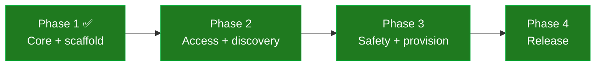
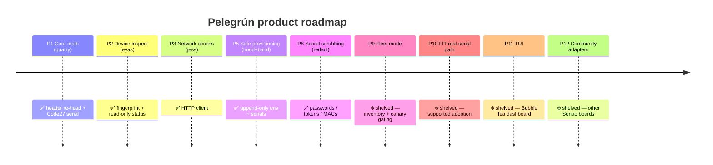

# Roadmap

Two views of the same project. The **development roadmap** is the engineering
execution order (core phases complete as of **v0.5.0**); the **product roadmap**
is the wider product surface — most of which is **shelved** pending real fleet
needs. Detailed task list:
[specs/001-pelegrun-mvp/tasks.md](specs/001-pelegrun-mvp/tasks.md).

> **Scope guarantee:** the tool's job is patching 4 bytes in a firmware header
> and providing three useful CLI utilities (discover, envcheck, redact). Fleet
> orchestration, multi-board adapters, and FIT adoption are product-roadmap
> ambition that will be built only when real need materialises.

Status: ✅ done · ❄️ shelved (code removed) · ⬜ planned.

---

## Development roadmap (shipped)

Engineering execution order — all core phases complete.

```mermaid
flowchart LR
  P1[Phase 1 ✅<br/>Core + scaffold] --> P2[Phase 2<br/>Access + discovery]
  P2 --> P3[Phase 3<br/>Safety + provision]
  P3 --> P4[Phase 4<br/>Release]
  style P1 fill:#1f7a1f,stroke:#0a3,color:#fff
  style P2 fill:#1f7a1f,stroke:#0a3,color:#fff
  style P3 fill:#1f7a1f,stroke:#0a3,color:#fff
  style P4 fill:#1f7a1f,stroke:#0a3,color:#fff
```

| Phase | Scope | Deliverable | Status |
|-------|-------|-------------|--------|
| 1 | Core + scaffold | tested `quarry` (Rust) + `pelegrun` skeleton + Spec Kit + CI | ✅ done |
| 2 | Access + discovery | `eyas` fingerprint, `jess` HTTP client | ✅ done |
| 3 | Safety + provision | `hood` env gate, `band` serials, `redact` scrubbing | ✅ done |
| 4 | Release | cross-compiled binaries + checksums, property tests, docs | ✅ done |

Rust unit + property tests (5 invariants) + real-image validation, Go 5 packages
including recorded fixtures + a Go↔Rust parity test, all green. Releases ship
cross-compiled binaries (Go ×5) with `SHA256SUMS` built locally via `make dist`.
This project uses no hosted CI: `make ci` is the gate, enforced by the
`githooks/pre-push` hook.

---

## Product roadmap (12 phases)

Where **Pelegrún** could go as a product. Phases 9–12 were prototyped but the
code was removed in v0.5.0 — they solved problems that don't exist yet at the
current scale.

```mermaid
timeline
    title Pelegrún product roadmap
    P1 Core math (quarry) : ✅ header re-head + Code27 serial
    P2 Device inspect (eyas) : ✅ fingerprint + read-only status
    P3 Network access (jess) : ✅ HTTP client
    P5 Safe provisioning (hood+band) : ✅ append-only env + serials
    P8 Secret scrubbing (redact) : ✅ passwords / tokens / MACs
    P9 Fleet mode : ❄️ shelved — inventory + canary gating
    P10 FIT real-serial path : ❄️ shelved — supported adoption
    P11 TUI : ❄️ shelved — Bubble Tea dashboard
    P12 Community adapters : ❄️ shelved — other Senao boards
```

| # | Phase | What ships | Status |
|---|-------|-----------|--------|
| 1 | Core image + serial math | `quarry`: one-field re-head, Code27, snextra, inspect CLI | ✅ |
| 2 | Firmware fingerprint | `eyas`: detect EWS-LuCI / cloud-React / FIT | ✅ |
| 3 | Network access | `jess`: HTTP client for cloud/LuCI APIs | ✅ |
| 5 | Safe env provisioning | `hood` + `band`: append-only writes, unique serials | ✅ |
| 8 | Secret scrubbing | `redact`: passwords, tokens, keys, MACs, explicit values | ✅ |
| 9 | Fleet mode | Inventory, policy, plan/apply, canary, journal, executor | ❄️ shelved |
| 10 | FIT real-serial path | Adopt via FIT with the device's real serial | ❄️ shelved |
| 11 | TUI | Bubble Tea dashboard (7-step guided flow) | ❄️ shelved |
| 12 | Community adapters | Board support registry for other Senao models | ❄️ shelved |

### Why shelved

The shelved phases were fully designed and prototyped (see git history before
v0.5.0), but they added 16 Go packages and 12 subcommands for a tool whose core
job is patching 4 bytes. The fleet, FIT, adapter, TUI, dump, and UART recovery
code will be rebuilt only when there's a concrete need — not as speculative
infrastructure.

### Shelved phase details (preserved for reference)

The full P9/P10/P12 designs — fleet identity model, policy engine, canary
orchestration, durable journals, FIT eligibility gates, adapter capability
contracts, hardware qualification matrices, and security/release hardening
requirements — are preserved in the git history. Consult the ROADMAP.md from
the commit before v0.5.0 for the complete specifications.

---

## Existing assets to leverage when un-shelving

| Asset | Value |
|---|---|
| `quarry` | Image/header/serial parser — the identity authority |
| `eyas` | Fingerprinting and firmware family detection |
| `jess` | HTTP client for cloud/LuCI APIs |
| `hood` | Environment mutation safety gate |
| `band` | Unique serial issuance and collision preflight |
| `redact` | Secret scrubbing for fixtures, logs, and support bundles |
| Property + parity tests | Regression foundation across Rust and Go |
| Git history | Full P9/P10/P12 prototypes, designs, and test suites |
