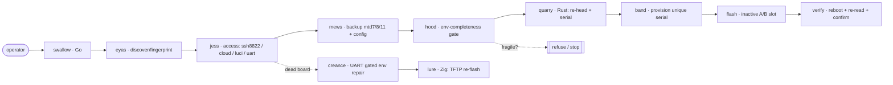

# Plan 001 — technical plan

**Stage:** Plan · **Status:** implemented (v0.4.0) · **Spec:** [spec.md](spec.md)

## Architecture (falconry pipeline)

## Tech stack + rationale
- **Rust `quarry` (done):** pure header/serial math, exhaustively unit-tested.
  Zero I/O. Ships as a lib + a standalone CLI so it is useful today.
- **Go `swallow`:** orchestration + all I/O. `x/crypto/ssh` is the only SSH stack
  that cleanly does the legacy `HostKeyAlgorithms=+ssh-rsa` these APs need on
  :8822; `net/http`+InsecureSkipVerify for the cloud GUI (`-k`) and LuCI. Trivial
  static cross-compile. The Code27 serial math is **reimplemented in pure Go**
  (`band`) so the common path needs no subprocess — kept honest by a Go↔Rust
  parity test against the `quarry` binary; the `product_id` re-head is exposed via
  the standalone `quarry` binary (no cgo).
- **Zig `lure`:** freestanding TFTP/BOOTP responder for deep-brick recovery,
  embedded in the binary, no runtime.

## Safety model (maps to Constitution I/II/III)
- `hood` parses `fw_printenv`, asserts `bootcmd`/`active_fw`/`rootfsname` present
  and coherent **before** any write; writes are append-only `fw_setenv`. No API in
  the codebase can erase or partial-save the env.
- `flash` always targets the inactive slot and re-reads slot state after.
- `mews` runs first and aborts the pipeline if the backup bundle is incomplete.

## Testing & CI
- **Rust:** `cargo test` — unit + property tests (5 invariants × 5000 cases) +
  error/Display tests + an opt-in real-image test (`make test-firmware`) that
  validates the parser against genuine firmware. `cargo fmt --check` + `clippy
  -D warnings` gate CI.
- **Go:** every package tested (CLI, TUI model, `eyas` with recorded HTTP
  fixtures, `jess` adapters via `httptest`, `hood`/`band`/`flash`/`mews`/`creance`),
  run under the **race detector**; a Go↔Rust parity test guards the reimplemented
  serial math; `gofmt` + `go vet` gated. ~89% statement coverage.
- **Zig:** `zig build` + `zig build test` (unit) + a real TFTP transfer
  integration test; `zig fmt --check` gated.
- **CI** runs all three on push/PR with formatting, linting, race, and coverage;
  a tag-triggered `release.yml` cross-compiles binaries + `SHA256SUMS`.
- A single `make` front-end (`make ci`) reproduces the whole gate locally.

## Milestones → dev phases
See [tasks.md](tasks.md) and `../../ROADMAP-DEV.md`. All six dev phases are
complete (v0.4.0); MVP = FR1–FR6 (dev phases 1–4).
