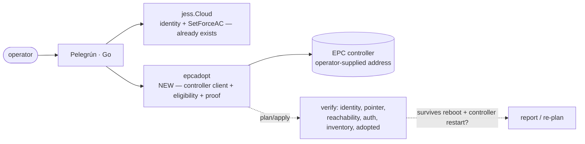

# Plan 002 — technical plan

**Stage:** Plan · **Status:** framework only · **Spec:** [spec.md](spec.md)

## Architecture



`epcadopt` is a new package, positioned exactly where `fitadopt` sits today:
consumes identity read by `jess`/`eyas`, never does its own AP-side flashing or
env writes, and produces plan/proof data structures rather than performing
opaque multi-step operations internally.

## Package shape (skeleton only — see `go/internal/epcadopt/`)

Mirror `fitadopt`'s existing two-gate shape, since it already matches this
spec's FR4/FR5 exactly:

- `Request` / `Result` (+ `Validate`) for the pre-flight eligibility gate —
  same shape as `fitadopt.Request`/`Validate`, adjusted fields for
  controller-scoped identity (org/network) instead of FIT-version identity.
- `Expected` / `Observed` (+ `Prove`) for the post-adoption proof gate — same
  shape as `fitadopt.Expected`/`Observed`/`Prove`.
- A `Client` interface (not a concrete HTTP struct yet) representing whatever
  the controller's actual management surface turns out to be — see spec.md's
  open question 1/2. Keep the interface narrow: `Login`, `RegisterDevice`,
  `DeviceStatus` are likely the only three methods callers need; resist adding
  more until a real controller confirms the shape. If direct datastore access
  turns out to be required rather than an API, model it as a **separate**,
  explicitly-named interface (e.g. `DatastoreSeeder`) so the plan/apply layer
  can treat it as a distinctly higher-risk operation (FR6), not silently fold
  it into `Client`.
- `Plan(...)` returning `[]flash.Step`-shaped entries (reuse the existing
  `flash.Step{Desc, Note, Gate}` type from `internal/flash` rather than
  inventing a parallel one) so the CLI's rendering code (`openwrt.go`'s
  `[GATE]`-marker loop) works unchanged for this new command too.

## CLI surface (`go/cmd/pelegrun/epc.go` — not yet created)

```
pelegrun epc check --ap <ip> --controller <addr> [--user --pass]
    read-only: AP identity + controller reachability + auth; report
    eligibility per FR4. Modeled on cmdOpenWrtCheck/cmdFitCheck.

pelegrun epc plan --ap <ip> --controller <addr> --org <id> --network <id>
    ordered, gated plan (FR6) — point AP at controller, register in
    inventory, verify checkin. Does not mutate until a future `--yes`-gated
    apply step, matching crossflash.go's stage-then-confirm pattern.

pelegrun epc prove --expected exp.json --observed obs.json
    post-adoption proof (FR5), modeled on `pelegrun fit prove` exactly.
```

All controller-identifying values (`--controller`, `--org`, `--network`,
credentials) are required flags or config-file input — never defaulted to a
real-looking value in code, tests, or docs (Constitution VII). Test fixtures
and examples must use obviously-fake placeholders (e.g. `controller.example`,
`org-000000000000000000000000`), the same way `examples/fit-*.json` uses
synthetic serials, never a real one.

## Tech stack + rationale

- **Go**, same as every other adapter/orchestration package — no new language
  needed. HTTP client reuses `jess.InsecureClient` if the controller also
  presents a self-signed cert (confirm against a real instance first, don't
  assume).
- If FR3's open question resolves to "direct datastore access is required,"
  that access should still be mediated through a narrow Go interface (not ad
  hoc scripts), so it can be swapped out cleanly if/when the controller grows a
  proper API — same "guarded edges" principle (Constitution IV) already applied
  to every other adapter in this codebase.

## Safety model (maps to Constitution)

- **II — prove, don't assume:** `epcadopt.Prove` reports every failed check,
  not just the first; "adopted" is not accepted as true until it has survived
  the reboot/restart check in spec.md scenario 4.
- **III — backup before you touch:** registering a device in controller
  inventory is not itself a device-side destructive operation, but the plan
  (FR6) must still surface *when* in the sequence a device-side mutation
  happens (e.g. `SetForceAC` + apply) so the existing backup-gate expectations
  from `flash.Plan`/`PlanOpenWrt` aren't silently bypassed by treating "point at
  controller" as harmless just because it's not a flash.
- **VI — legal/ethical scope:** this package only automates operations an
  operator could already do by hand through the controller's own admin
  surface; it does not create new access, bypass licensing, or defeat any
  controller-side protection.
- **VII — no secrets, no leaks:** the single most important constraint on this
  spec. Every real value harvested while investigating this feature (addresses,
  IDs, device identity) stays in the operator's own local environment/config —
  never in this repo's code, tests, docs, or commit history.

## Testing plan

- `epcadopt.Validate`/`Prove`: pure, deterministic, table-driven unit tests —
  same style as `fitadopt_test.go`. No network I/O in these tests.
- `Client` implementations: `httptest`-based fixtures, same pattern as
  `jess`'s `flashops_test.go` — synthetic, clearly-fake request/response
  bodies, not captured real traffic.
- CLI (`epc.go`): `runCap`-based tests mirroring `openwrt_test.go`/`fit_test.go`
  exactly (usage, missing-flag errors, gated-apply behavior).
- No real controller in CI — this project has no hosted CI and no lab hardware
  in the test environment; real-controller validation is a manual,
  operator-run step (documented in a follow-up USAGE.md section once the
  protocol questions are resolved), the same way `make test-firmware` is an
  opt-in real-hardware check rather than part of `make ci`.

## Milestones

See [tasks.md](tasks.md). This plan covers framework/scaffolding only — no
task here should require a live controller to complete; tasks that do require
one are explicitly marked and sequenced last.
